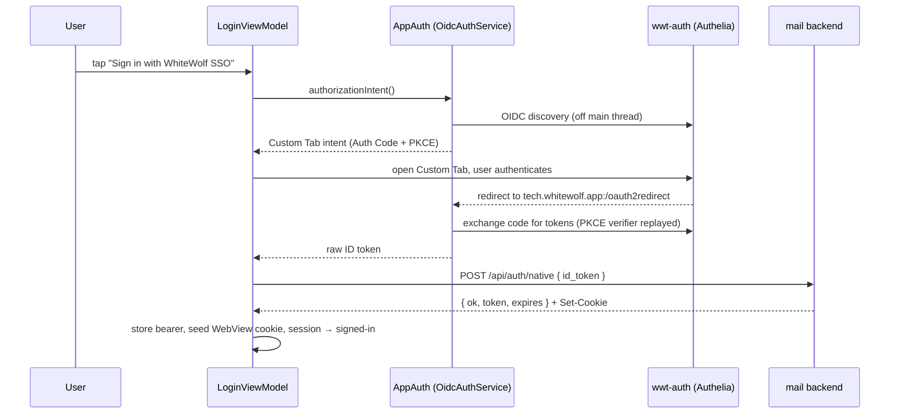

# WWT Mobile

The White Wolf Technology Android app (`tech.whitewolf.app`) — a thin native
**shell** that hosts the Maileroo email SPA in a WebView, adding the things a web
app can't do for itself: native sign-in, a session it can seed into the WebView,
push notifications, offline handling, and system dark mode.

- **UI**: Jetpack Compose (`MainActivity` → `ShellScreen`).
- **Mail backend**: `mail.whitewolf.tech` (the SPA's origin; also the auth API).
- **Identity provider**: `auth.whitewolf.tech` — wwt-auth, an [Authelia](https://www.authelia.com/) OIDC provider.
- **Push**: UnifiedPush against self-hosted ntfy (`ntfy.whitewolf.tech`) — see [docs/PUSH.md](docs/PUSH.md).
- **DI**: manual, via `AppContainer` — no framework.
- **SDK**: minSdk 29, target/compile 35, JVM 17.

## Sign-in

The shell offers two ways in, both of which end at the **same** app session — a
bearer token in encrypted storage plus a matching WebView session cookie:

- **Password** — `POST /api/login` with email + password.
- **Native SSO** — the OIDC flow below (`WWT-67`), offered as the
  *"Sign in with WhiteWolf SSO"* button on the login screen.

Once either path succeeds, `SessionBus` flips to signed-in and `ShellScreen`
swaps the login screen for the WebView, which loads already authenticated because
the session cookie was seeded for it.

## Native SSO flow

The app runs the OIDC dance **itself** — it does not hand sign-in off to the
WebView. It's an **Authorization Code + PKCE (S256)** flow in a Chrome Custom Tab
against wwt-auth, using a **public client** (`maileroo-mobile`) — no client secret
ships in the app. The app never sees the user's password; it comes away with an
OIDC **ID token**, which the mail backend exchanges for an app session.



Step by step:

1. **Start.** The login screen's SSO button calls `LoginViewModel.startSso`.
   Off the main thread, `OidcAuthService.authorizationIntent()` runs **OIDC
   discovery** against the issuer and builds an Authorization Code request —
   scope `openid profile email groups`, response type `code`, client
   `maileroo-mobile`, redirect `tech.whitewolf.app:/oauth2redirect`. AppAuth
   generates the PKCE verifier/challenge automatically.
2. **Custom Tab.** The resulting intent is handed to an activity-result launcher
   (`ShellScreen`), which opens the IdP sign-in page in a Chrome Custom Tab.
3. **Redirect.** After the user authenticates, wwt-auth redirects to
   `tech.whitewolf.app:/oauth2redirect`. AppAuth's `RedirectUriReceiverActivity`
   catches it and returns the result to the launcher, which calls
   `LoginViewModel.onSsoResult`. (A dismissed tab returns `null` — no error, just
   stop the spinner.)
4. **Token exchange.** `OidcAuthService.completeAuthorization` parses the
   authorization response and exchanges the code for tokens. The PKCE verifier is
   replayed from inside the original request, so it **never leaves the device**.
   The result is the raw **ID token**.
5. **Backend exchange.** `AuthRepository.loginWithSso` posts `{ id_token }` to
   **`POST /api/auth/native`**. The backend verifies the token and returns the
   same `{ ok, token, expires }` body and `Set-Cookie` session cookie that
   password login would.
6. **Session.** The shared `storeSession` tail saves the bearer to the encrypted
   `TokenStore`, seeds the WebView's session cookie, and marks `SessionBus`
   signed-in. The WebView then loads already authenticated.

### Session lifecycle

- **Validation.** A stored bearer can be unexpired locally yet dead server-side
  (e.g. the backend bumped `token_version` to revoke sessions).
  `AuthRepository.validate()` asks `GET /api/me`; **only a 401 signs you out** —
  offline / DNS / 5xx leave the session intact (unreachable ≠ signed out).
- **Invalidation vs. logout.** A 401 anywhere (e.g. push registration) calls
  `invalidate()`, which clears the session *and* shows a "session expired" notice.
  A user-initiated `logout()` clears the same state but shows no notice.

### Redirect registration

There is deliberately **no** `<activity>` for the redirect in
`AndroidManifest.xml`. AppAuth ships `RedirectUriReceiverActivity` in its own
library manifest with an intent filter keyed on the placeholder
`${appAuthRedirectScheme}`; the app supplies that scheme in `build.gradle.kts`:

```kotlin
manifestPlaceholders["appAuthRedirectScheme"] = "tech.whitewolf.app"
```

The manifest merger substitutes it at build time, registering the intent filter
for scheme `tech.whitewolf.app` — matching the redirect URI. Declaring the
activity by hand would just duplicate what the library already provides.

### Configuration

The OIDC endpoints are `BuildConfig` fields in `app/build.gradle.kts`:

| Field | Value |
| --- | --- |
| `OIDC_ISSUER` | `https://auth.whitewolf.tech` |
| `OIDC_CLIENT_ID` | `maileroo-mobile` |
| `OIDC_REDIRECT_URI` | `tech.whitewolf.app:/oauth2redirect` |
| `MAIL_BASE_URL` | `https://mail.whitewolf.tech` |

### Key files

| File | Role |
| --- | --- |
| `auth/OidcAuthService.kt` | AppAuth wrapper: discovery, authorization intent, code→token exchange (raw ID token out) |
| `auth/SsoLogin.kt` | `SsoLogin` seam + `OidcSsoLogin`, wiring AppAuth to the backend so the ViewModel carries no AppAuth types |
| `auth/AuthRepository.kt` | `loginWithSso` (`/api/auth/native`), password login, session storage, `validate`/`invalidate` |
| `auth/LoginViewModel.kt` | `startSso` / `onSsoResult`, `ssoAvailable` |
| `ui/LoginScreen.kt` | The SSO button and password form |
| `ui/ShellScreen.kt` | Hosts the Custom Tab activity-result launcher; swaps login ↔ WebView |
| `AppContainer.kt` | Builds the real graph (`OidcSsoLogin(OidcAuthService(...), auth)`) |

## Build & test

Requires a JDK 17 and the Android SDK (point `ANDROID_HOME` at it).

```bash
# Unit tests (JVM — auth, view-model, push logic)
./gradlew :app:testDebugUnitTest

# Instrumented tests (needs a device/emulator — Compose UI, encrypted store)
./gradlew :app:connectedDebugAndroidTest

# Debug APK
./gradlew :app:assembleDebug
```

Release version and git SHA are injected by CI via `-PversionName` /
`-PversionCode` / `-PgitSha`; local builds fall back to dev defaults and the live
short SHA.

### Pointing a build at another backend

The endpoints default to the White Wolf deployment and each takes a `-P` override,
so you can build against your own mail backend and OIDC provider without editing
`app/build.gradle.kts`:

```bash
./gradlew :app:assembleDebug \
  -PmailBaseUrl=https://mail.example.test \
  -PntfyHost=ntfy.example.test \
  -PoidcIssuer=https://auth.example.test \
  -PoidcClientId=my-client
```

The redirect URI (`tech.whitewolf.app:/oauth2redirect`) is not overridable — it is
tied to `applicationId` and the AppAuth manifest placeholder, so register that same
URI with your own provider.

## Licence

Apache License 2.0 — see [LICENSE](LICENSE) and [NOTICE](NOTICE).
